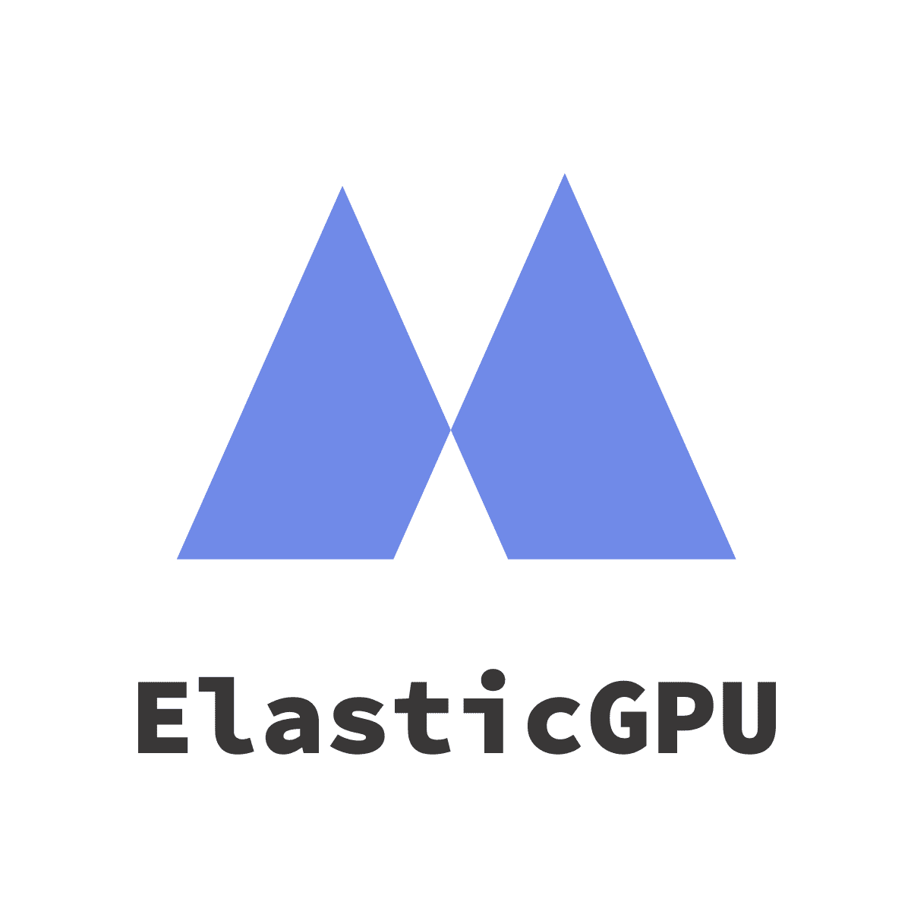
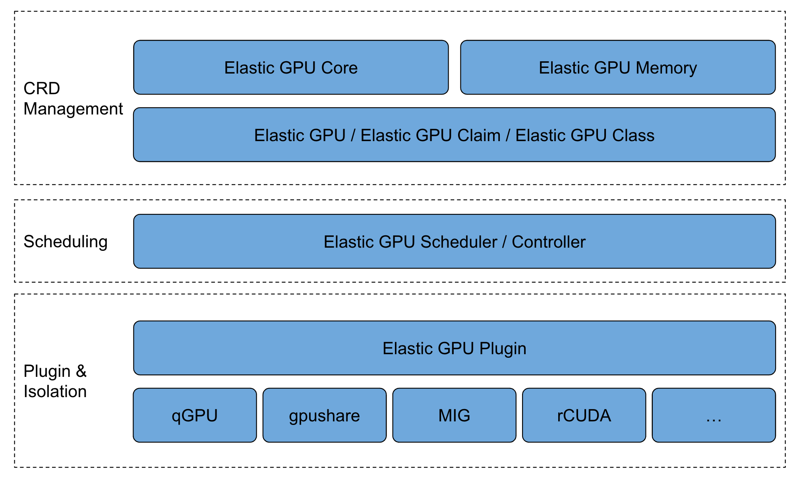

# Elastic GPU - Using CRDs to Manage GPU Resources in Kubernetes
<div align="left"></div>

*Managing Your GPUs in a Kubernetes-Native Way.*

---

**Elastic GPU** allows users to manage, schedule, and allocate GPU resources by using CRDs in a Kubernetes-native way. It is completely cloud native and can be deployed in any Kubernetes that meets the requirements of the version. Elastic GPU also provides the implementation of standard scheduler and agent around CRDs, which can support GPU sharing, whole-card scheduling and GPU remote instances. Elastic GPU also provides a framework that allows third-party GPU technology solutions to be integrated into Elastic GPU in the form of plug-ins, eventually giving users a consistent experience.

The main components of Elastic GPU are as follows:

- Elastic GPU CRDs: CRDs schema and as-is interface.
- Elastic GPU Scheduler: general GPU scheduler, which supports GPU sharing, whole card, GPU remote instance and third party GPU scheduling plug-in.
- Elastic GPU Agent: general GPU Agent, supporting GPU sharing, whole card, GPU remote instance and third party GPU device plug-in.
- Elastic GPU Framework: GPU unified management and scheduling framework, following Elastic GPU CRDs principles, plug-in design.

## Architecture


## Concepts
- `ElasticGPU` is a resource device abstraction CRD, which can be a local GPU physical card, a GPU slice resource (combination of GPU computing power / video memory), and a remote GPU device.
- `ElasticGPUClaim` is GPU requests applied for the number of cards, GPU core / memory, or TFLOPS which stands for ElasticGPU computing ability.
- `EGPUClass` provides a way to provision, attach and mount `ElasticGPU`, using qGPU virtualization, vCUDA, or GPU remote pooling technology.
- `GPU Sharing` supports multiple containers to share the same GPU card, and supports 1% computing power and MB level video memory allocation.
- `Two-Tier Scheduling` supports scheduling at the node / GPU card level, and each layer supports binpack / spread policies.
- `GPU Isolation` supports the integration of isolation technologies such as qGPU and MIG to provide container-level GPU resource isolation capabilities for users.
- `Dynamic Provision` supports the ability to dynamically create local or remote GPU devices, bind and mount GPU devices during Pod creation

## Getting Started
```
$ kubectl apply -f https://raw.githubusercontent.com/elastic-ai/elastic-gpu/master/manifests/elasticgpu.io_elasticgpuclaims.yaml
$ kubectl apply -f https://raw.githubusercontent.com/elastic-ai/elastic-gpu/master/manifests/elasticgpu.io_elasticgpuclasses.yaml
$ kubectl apply -f https://raw.githubusercontent.com/elastic-ai/elastic-gpu/master/manifests/elasticgpu.io_elasticgpus.yaml
$ kubectl apply -f https://raw.githubusercontent.com/elastic-ai/elastic-gpu/master/manifests/elasticgpu.io_gpus.yaml
$ kubectl apply -f https://raw.githubusercontent.com/elastic-ai/elastic-gpu-scheduler/master/deploy/elastic-gpu-scheduler.yaml
$ kubectl apply -f https://raw.githubusercontent.com/elastic-ai/elastic-gpu-agent/master/deploy/elastic-gpu-agent.yaml
```

## Examples
```
cat <<EOF  | kubectl create -f -
apiVersion: elasticgpu.io/v1alpha
kind: ElasticGPUClass
metadata:
  name: gpushare-egpuclass
provisioner: gpushare.provisioner.elasticgpu.io
reclaimPolicy: Retain
egpuBindingMode: Immediate
---
apiVersion: elasticgpu.io/v1alpha
kind: ElasticGPUClaim
metadata:
  name: gpushare-egpuc-1
spec:
  egpuClassName: gpushare-egpuclass
  resources:
    requests:
      gpushare.provisioner.elasticgpu.io/gpu-core: 10
      gpushare.provisioner.elasticgpu.io/gpu-memory: 4
---
apiVersion: elasticgpu.io/v1alpha
kind: ElasticGPUClaim
metadata:
  name: gpushare-egpuc-2
spec:
  egpuClassName: gpushare-egpuclass
  resources:
    requests:
      gpushare.provisioner.elasticgpu.io/gpu-core: 10
      gpushare.provisioner.elasticgpu.io/gpu-memory: 4
EOF
```

```
cat <<EOF  | kubectl create -f -
apiVersion: v1
kind: Pod
metadata: test-cuda-1
annotations:
  egpuc.elasticgpu.io/test1: gpushare-egpuc-1
spec:
  containers:
  - name: test-cuda
	image: nvidia/cuda:10.0-base
---
apiVersion: v1
kind: Pod
metadata: test-cuda-2
annotations:
  egpuc.elasticgpu.io/test1: gpushare-egpuc-2
spec:
  containers:
  - name: test-cuda
    image: nvidia/cuda:10.0-base
EOF
```

## Contact
If you've got any questions, please feel free to contact us with following ways:
- [open a github issue](https://github.com/elastic-ai/elastic-gpu/issues/new)
- [mailing list](mailto:elasticgpu@googlegroups.com) 
- [join discussion group](https://groups.google.com/g/elasticgpu)

## License
Distributed under the [Apache License](./LICENSE).
